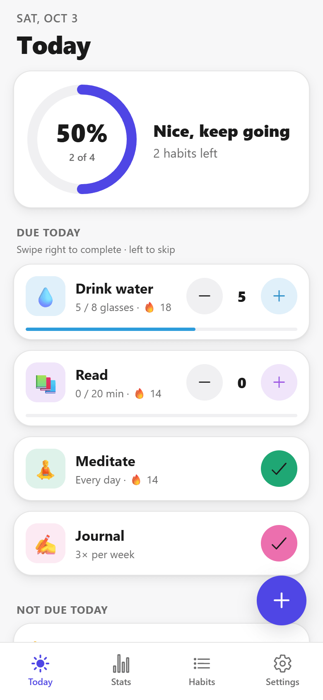
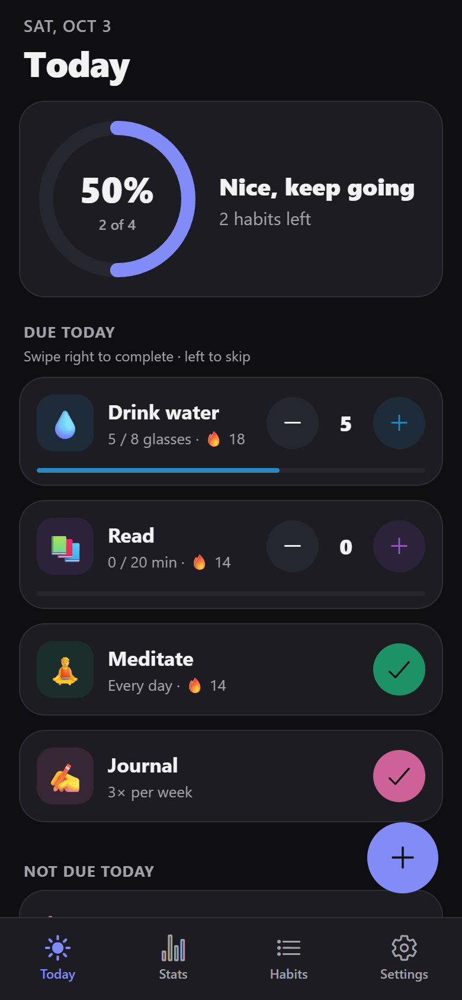
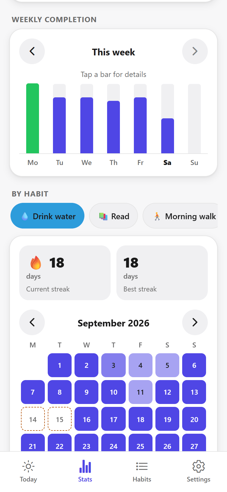
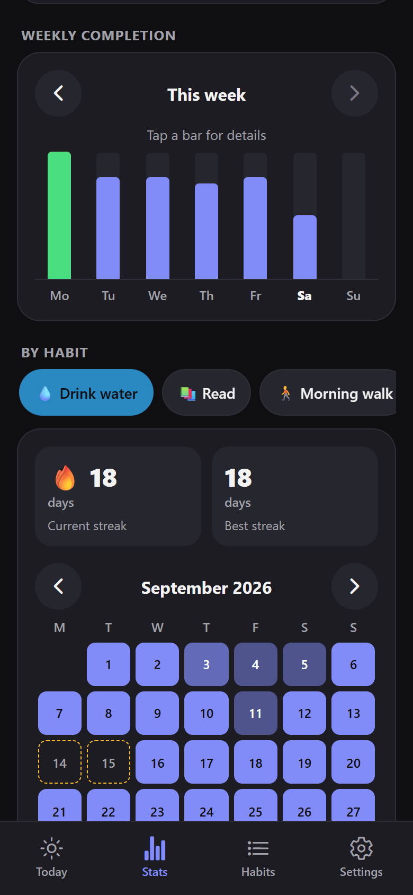
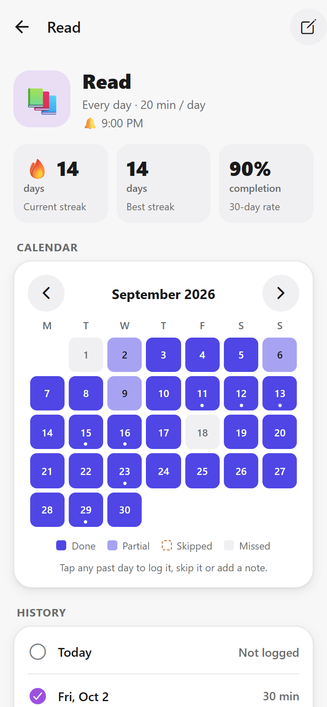
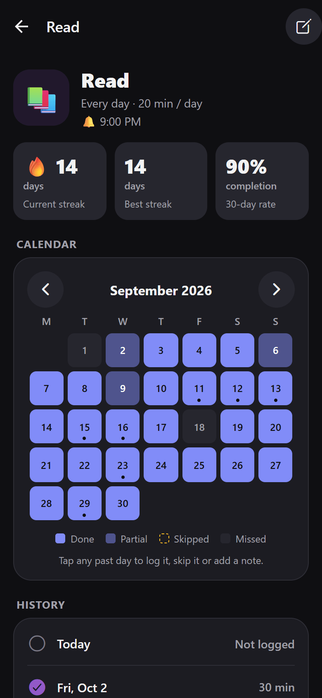
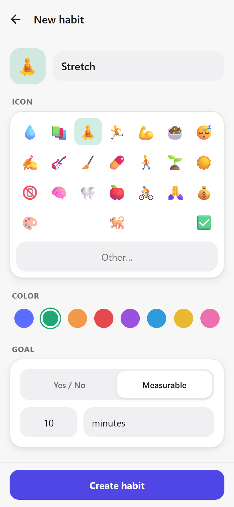
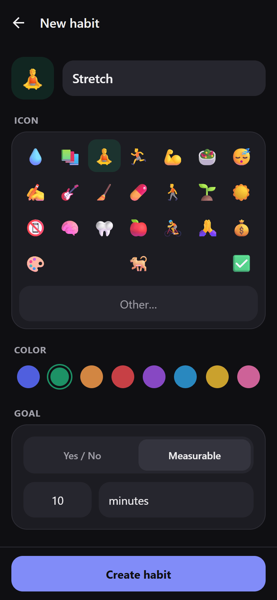
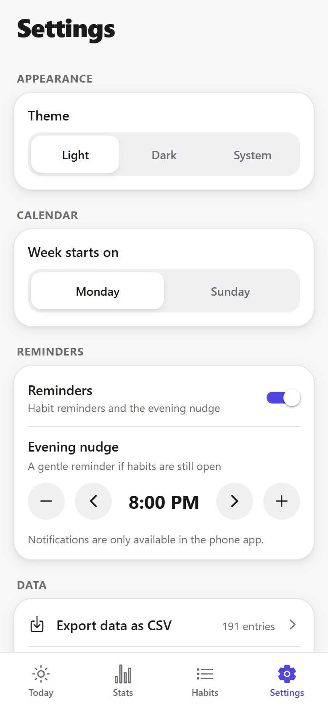
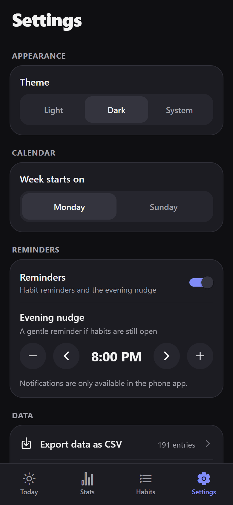

# Habits

[](./LICENSE)

A mobile habit tracker app for building and tracking daily habits: simple to log, works offline, and keeps your data on your phone.

<p align="center">
  
  &nbsp;&nbsp;
  
</p>

## Screenshots

<table>
  <tr>
    <th>Light</th>
    <th>Dark</th>
  </tr>
  <tr>
    <td></td>
    <td></td>
  </tr>
  <tr>
    <td colspan="2" align="center"><em>Today: progress ring and habit cards (tap, +/−, or swipe to complete or skip)</em></td>
  </tr>
  <tr>
    <td></td>
    <td></td>
  </tr>
  <tr>
    <td colspan="2" align="center"><em>Stats: weekly completion chart, streaks and monthly heatmap</em></td>
  </tr>
  <tr>
    <td></td>
    <td></td>
  </tr>
  <tr>
    <td colspan="2" align="center"><em>Habit detail: streaks, completion rate, calendar (tap a day to backfill or add a note)</em></td>
  </tr>
  <tr>
    <td></td>
    <td></td>
  </tr>
  <tr>
    <td colspan="2" align="center"><em>New habit: name, emoji, color, yes/no or measurable goal, frequency and reminder</em></td>
  </tr>
  <tr>
    <td></td>
    <td></td>
  </tr>
  <tr>
    <td colspan="2" align="center"><em>Settings: Light / Dark / System theme, week start, reminders and data export</em></td>
  </tr>
</table>

## Features

- **Create habits** with a name, emoji and color tag.
  - **Yes/no** habits are checked off once a day. **Measurable** habits track progress toward a daily target, such as 8 glasses of water or 30 minutes of reading.
  - Frequency can be every day, specific weekdays, or X times per week.
  - Each habit can have an optional reminder time.
- **Today screen**
  - A progress ring shows how much of today's list is done.
  - Habits appear as large, one-handed cards: tap to check off, use **+ / −** for measurable habits, or long-press to enter a value or a note.
  - Swipe **right** to complete and **left** to skip. Skipped days are excused, not failed.
  - Confetti plays when everything for the day is done.
- **Streaks and stats**
  - Each habit shows its current and best streak. Streaks respect the habit's schedule, so a Mon/Wed/Fri habit isn't broken by Tuesday.
  - Each habit has a monthly calendar heatmap.
  - A weekly completion bar chart and your overall completion rate over the last 7, 30 or 90 days.
- **Daily notes and backfilling:** tap any past day on a habit's calendar or history to mark it done, skipped or missed, or to add a short journal note.
- **Local reminders and notifications:** each habit can remind you at its reminder time, and an optional evening nudge reminds you when habits are still open.
- **Light, Dark and System theme modes**, switchable instantly in Settings.
- **Works offline with local storage.** No account or login is needed, and nothing leaves the device.
- **CSV data export** through the share sheet, plus a "reset all data" option.
- **Other settings:** the week can start on Monday or Sunday, and habits can be archived, restored or deleted.

## Tech Stack

| Area | What's used |
| --- | --- |
| Framework | [Expo](https://expo.dev) SDK 57, React Native 0.86, React 19 |
| Language | TypeScript |
| Navigation | Expo Router (file-based routing: bottom tabs + stack) |
| Storage | `expo-sqlite` on phones (tables for habits, entries and settings); browser storage on web. Local only |
| State | A small custom store built on React's `useSyncExternalStore` |
| Animations and gestures | `react-native-reanimated`, `react-native-worklets`, `react-native-gesture-handler` |
| Graphics | `react-native-svg` (progress ring), `@expo/vector-icons` (Ionicons) |
| Notifications | `expo-notifications` (local, scheduled) |
| Export | `expo-file-system`, `expo-sharing` |
| Platform polish | `expo-haptics`, `expo-splash-screen`, `expo-system-ui`, `expo-status-bar` |
| Web preview | `react-native-web`, `react-dom` |
| Tooling | ESLint (`eslint-config-expo`), `tsx` (runs the tests) |

The package manager is **npm**; `package-lock.json` is committed.

## Getting Started

### Prerequisites

- **Node.js** 20.19.4 or newer (an LTS release such as 22 or 24 is recommended).
- **npm**, which comes with Node.
- A way to run the app, any of:
  - The **Expo Go** app on your phone (quickest).
  - **Android Studio** with an Android emulator.
  - **Xcode** with an iOS Simulator (macOS only).
  - A web browser, for a quick preview.

You don't need to install the Expo CLI globally. The project uses the local CLI through `npx expo`.

### Installation

```bash
git clone <your-repo-url> habit-tracker
cd habit-tracker
npm install
```

### Run the app

Start the dev server, then scan the QR code with Expo Go, or press `a` (Android) or `i` (iOS) in the terminal:

```bash
npm start
```

Or open a platform directly:

```bash
npm run android   # Android emulator or connected device
npm run ios       # iOS Simulator (macOS only)
npm run web       # Browser preview (no notifications or haptics)
```

> **Reminders on Android:** Expo Go on Android can't load `expo-notifications`, so the app runs there with reminders turned off.
> To get reminders, use a development build:
>
> ```bash
> npx expo run:android
> npx expo run:ios      # macOS only
> ```

### Checks

```bash
npm test            # streak/scheduling logic and theme-contrast tests
npm run typecheck   # TypeScript
npm run lint        # ESLint
```

## Project Structure

```text
habit-tracker/
├── app.json              # Expo config: name, icons, splash, plugins
├── assets/               # App icon, splash and favicon images
└── src/
    ├── app/              # Screens (Expo Router: every file is a route)
    │   ├── _layout.tsx   # Root stack, theme provider, splash and notifications setup
    │   ├── (tabs)/       # Bottom tabs: Today, Stats, Habits, Settings
    │   └── habit/        # New habit (modal), habit detail, edit habit
    ├── components/       # UI: habit card, progress ring, heatmap, charts, forms, sheets
    └── lib/              # Logic: data types, store, scheduling/streaks, notifications,
                          # CSV export, theme tokens, date helpers (+ tests)
```

## Data Model

All data is stored on the device: in a SQLite database on phones (`habits`, `entries` and `settings` tables, plus a `meta` table with the schema version), and in browser storage on web. After each successful launch, a last-known-good backup copy is saved separately. If saved data ever fails to load, the app shows a recovery screen instead of starting empty.

**Habit**

| Field | Description |
| --- | --- |
| `id` | Unique ID |
| `name`, `icon`, `color` | Display name, emoji, color tag |
| `frequency` | `daily`, `weekdays` (a list of days), or `timesPerWeek` (a count) |
| `type` | `boolean` (yes/no) or `measurable` |
| `target`, `unit` | Daily goal for measurable habits, such as `8` `glasses` |
| `reminderTime` | `"HH:MM"` or `null` |
| `createdAt` | ISO timestamp |
| `archived` | Hidden from Today and Stats when `true` |

**Entry**: one per habit per day

| Field | Description |
| --- | --- |
| `habitId` | The habit it belongs to |
| `date` | Local calendar day, `"YYYY-MM-DD"` |
| `value` | Amount logged (1 for a completed yes/no habit) |
| `status` | `done`, `skipped` (excused), or `missed` |
| `note` | Optional short journal entry |

Settings (week start, reminders, evening nudge time and theme) are stored alongside them.

## Building for Production

Release builds use [EAS Build](https://docs.expo.dev/build/introduction/), Expo's cloud build service. It needs a free Expo account. EAS CLI isn't a project dependency, so run it with `npx`:

```bash
npx eas-cli@latest login
npx eas-cli@latest build:configure          # creates eas.json (first time only)
npx eas-cli@latest build --platform android # Android App Bundle (.aab) for Google Play
npx eas-cli@latest build --platform ios     # .ipa for the App Store (needs an Apple Developer account)
```

To get an installable **APK** instead of an AAB, add a build profile with `"android": { "buildType": "apk" }` to `eas.json` and build with `--profile <name>`.

**Building locally** (requires Android Studio, or Xcode on macOS):

```bash
npx expo run:android --variant release
npx expo run:ios --configuration Release
```

**Web build** (static files in `dist/`):

```bash
npx expo export --platform web
```

## Roadmap

- ☁️ Optional cloud sync and backup across devices
- 📱 Home screen widgets for checking off habits
- 🗂️ Habit categories and filtering
- 🏆 Achievements and milestone badges
- 📥 CSV import to restore exported data

## Contributing

Contributions are welcome!

1. Fork the repository.
2. Create a branch: `git checkout -b feature/my-change`.
3. Make your change, then run `npm test`, `npm run typecheck` and `npm run lint`.
4. Commit and push, then open a pull request describing what changed and why.

## License

This project is licensed under the MIT License — see the [LICENSE](./LICENSE) file for details.
